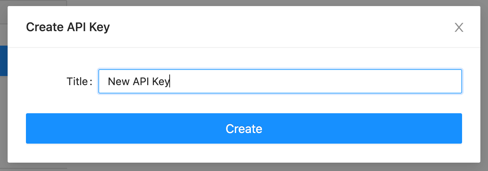
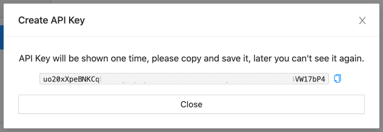

# API Key Access

If you develop a server-side application like a Property Management System (PMS) or Revenue Management (RMS) or similar.

You will need to use the API key method instead of user credentials

In the future logging in with user credentials will trigger 2-factor authentication which will break your integration.

## Setup an API Key

This feature is not available for all Users by default, to enable it you will need to have an active subscription.

If we have just subscribed and it does not show try refresh browser or logout and back in.

In the [User Profile](https://{{domain}}/user\_profile) you will see a new section: `API Keys`.

.png>)

Press `Create new API Key`, fill API Key name and press `Create` to generate a new API Key.



After that, you should see the next message:



### Warning
Please, copy the API Key and keep it in a safe place.\
API Key will only be shown once.\
If you lose the API Key, you can generate a new one.

## API Key Usage

To send an API requests using the API Key, you should pass it as `user-api-key` header into request.

```
GET /api/v1/properties/ HTTP/1.1
Host: {{staging_domain}}
Content-Type: application/json
user-api-key: uU08XiMgk8a7CrY4xUjAReUIuTrn83R123adaVb8Tf/qMcVTEgriuJhXWs/1Q1P
```

## Revoke API Key

Sometimes, an API Key can be compromised. This can happen for many different reasons - forgetting the key at a git repo or something else. If you think your API Key is compromised you can revoke that key.

At your User Profile, find your key at list and press `Actions` button, choose `Withdraw` action and confirm action.

The API key will still be listed and not removed, just disabled.

.png>)

## What is possible via the API Key

Using the key you will get access to the same powers as the user, but you don't have to use username and password to login.
