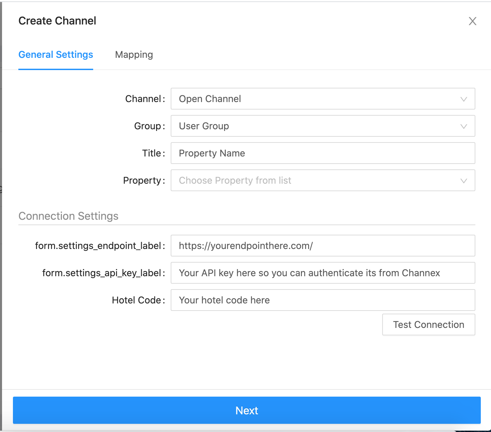
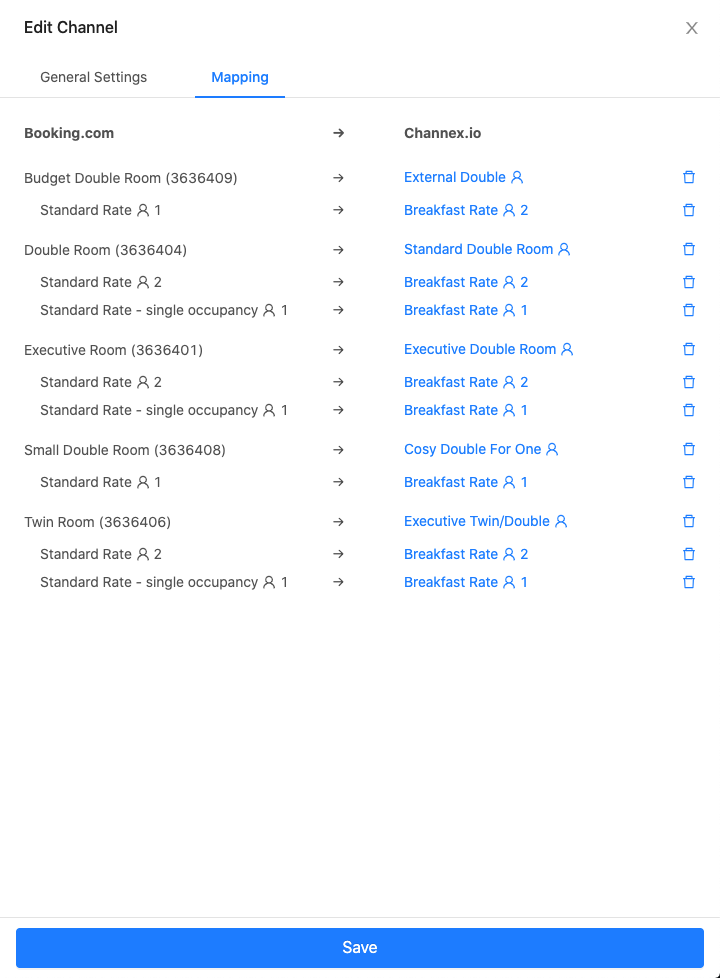

# Open Channel API

## Introduction

To connect your platform to [{{APPLICATION_NAME}}]({{APPLICATION_DOMAIN}}) we have provided a Push API so you can get real time changes of Availability, Prices and Restrictions and push bookings to {{APPLICATION_NAME}}. Please see the information below on how to integrate.

We will cover the next key points:

* Endpoint to test connection between your side and {{APPLICATION_NAME}}
* Endpoint to expose mapping details from your side to {{APPLICATION_NAME}}
* Endpoint to receive inventory changes from {{APPLICATION_NAME}} at your side
* Endpoint to request Full Sync from {{APPLICATION_NAME}} to your side \(Coming Soon\)
* How to push bookings from your side to {{APPLICATION_NAME}}

### Create a Staging Server Account

To get started you need to sign up to {{APPLICATION_NAME}} staging server and create a test property at {{STAGING_DOMAIN}}

Once you have made your account you just need to make a test property, with some rooms and rates. You can find some help files on creating that here.

### Channel / OTA Eligibility and Process

At {{APPLICATION_NAME}} we allow any channel to connect, be assured if you want to be a {{APPLICATION_NAME}} Channel you will be certified if your technical integration passes all our testing.

You just need to create a test property with some rooms and rates, then create a "Open Channel" so you can self integrate.

### Create the Open Channel

Once you have created your test property go to channels and click **Add New** button



The "Open Channel" is our way to let you self connect as a channel instead of requiring any manual assistance from {{APPLICATION_NAME}}. It's also flexible allowing you to integrate from any domain or test server before you certify.

**Channel**: This should be set to "Open Channel"

**Group**: What property group you want to use, if test account only one should show here

**Title**: This is just a text description of your connection, either property name or some other text is acceptable and not used apart from the UI

**Property**: Select you test property you have created

**Connection Settings**

**Endpoint**: Enter the endpoint where you will receive our api calls

**API Key**: Your API key to identify {{APPLICATION_NAME}} api push. This is also needed when you push bookings back.

**Hotel Code**: Your hotel code to identify which property on your side. This will be your property ID.

## API Endpoints

### Requirements

To implement the connection between your service and {{APPLICATION_NAME}} you should implement several API endpoints, these will provide information about the connected property from your side and / or receive changes that has happened at the property state.

All API endpoints should be placed at same level and should have predefined names:  
**https://your-website.com/api/v1/**mapping\_details/

At this example, part written at bold, can be custom and we are expect to get this value as endpoint at Open Channel configuration.

`mapping_details/` part is predefined and should be same. Endpoint should end with `/` symbol.

As result, we  expect to see the next API endpoints:

* test\_connection
* mapping\_details
* changes

API Endpoints can be closed by API Key authorization. If you choose this way, please, use header with name api-key to check authorization and provide required API key into API Key field at Channel settings.

### Test Connection endpoint

This endpoint will be used to check the connection, using a hotel code which is provided by the user \(hotel\_code\). {{APPLICATION_NAME}} will send GET request to this endpoint and expect to receive a successful result.

We expect to see GET endpoint protected by API Key authentication. Endpoint should allow a GET argument with hotel\_code

**Query**

```text
GET your_site.com/api/test_connection/?hotel_code={HOTEL_CODE}
```

**Expected Response**

```text
{
  "success": true
}  
```

**Expected Response Status Code:** `200 OK`

### Mapping details endpoint <a id="Mapping-details-endpoint"></a>

This endpoint will be used to get information about Room Types and Rate Plans from your side. This will allow the user to map in the {{APPLICATION_NAME}} interface.



We expect to see the GET endpoint protected by API Key authentication. Endpoint should allow a GET argument with a `hotel_code` and return room and rate details for mapping.

**Query**

```text
GET your_site.com/api/mapping_details/?hotel_code={HOTEL_CODE}
```

**Expected Response**

```text
{
  "data": {
    "type": "mapping_details",
    "attributes": {
      "room_types": [
        {
          "id": "{ROOM_ID}",
          "title": "{ROOM_TITLE}",
          "rate_plans": [
            {
              "id": "{RATE_PLAN_ID}",
              "title": "{RATE_PLAN_TITLE}",
              "sell_mode": "{per_room | per_person}",
              "max_persons": {OCCUPANCY},
              "currency": "{CURRENCY_ISO_CODE}",
              "read_only": false
            }
          ]
        }
      ]
    }
  }
}
```

**Expected Response Status Code:** `200 OK`

#### Field Description

**`room_types`**  
List of room types available at your side for mapping. Should contain id, title and rate\_plans

**`rate_plans`**  
List of rate plans associated with room type available at your side for mapping. Should contain id, title, sell\_mode, max\_persons, currency, read\_only.

**`sell_mode`**  
Flag to show how room is sell at your side. Can have one of 2 options: per\_room or per\_person. If rate plan is set as per\_room {{APPLICATION_NAME}} will provide updates only for max\_persons occupancy. If rate plan is set as per\_person [{{APPLICATION_NAME}}]({{APPLICATION_DOMAIN}}) will provide updates for each mapped occupancy \(from 1 to max\_persons\).

**`max_persons`**  
Max count of guests allowed by rate plan. Integer value greater than 0.

**`currency`**  
ISO 4217 3-alpha currency code of rate plan.

**`read_only`**  
If your rate plan does not allow updates, but can be sold at 3rd party side, you can pass it with flag read\_only equal to true. In that case, we will allow user to map this rate plan but not provide updates for this rate plan.

### Changes API

Each time {{APPLICATION_NAME}} catches any changes at the property state associated with Rate Plans or Room Types mapped to your system, we will generate a changes message and send it to changes endpoint at your side via POST request.

### WARNING
Min Stay Requirements

Does your system accept Min Stay Arrival & Min Stay Through? If you only support one please get in touch with us for workaround.

We expect to see the POST endpoint protected by API Key authentication. Query will contain JSON message with changes.

**Query:**

```text
POST your_site.com/api/changes/

{
  "data": [
    {
      "type": "changes_notification",
      "attributes": {
        "request_id": "{UUID}",
        "hotel_code": "{HOTEL_CODE}",
        "changes": [
          {
            "type": "availability_changes",
            "attributes": {
              "room_type_id": "{ROOM_TYPE_ID}",
              "date_from": "2020-02-02",
              "date_to": "2020-02-04",
              "availability": 10
            }
          },
          {
            "type": "restriction_changes",
            "attributes": {
              "rate_plan_id": "{RATE_PLAN_ID}",
              "date_from": "2020-02-02",
              "date_to": "2020-02-04",
              "rates": [
                {
                  "rate": "200.00",
                  "currency": "GBP",
                  "fraction_size": 2
                }
              ],
              "stop_sell": true,
              "closed_to_arrival": false,
              "closed_to_departure": false,
              "min_stay_arrival": 1,
              "min_stay_through": 1,
              "max_stay": 0,
            }
          }
        ]
      }
    }
  ]
}
```

**Expected response:**

```text
{
  "success": true,
  "unique_id": KEY
}
```

Where `unique_id` is a unique key, which can be used to identify the query at an incident review process.

#### Multi Occupancy example

```text
{
  "data": [
    {
      "type": "changes_notification",
      "attributes": {
        "request_id": "{UUID}",
        "hotel_code": "{HOTEL_CODE}",
        "changes": [
          {
            "type": "restriction_changes",
            "attributes": {
              "rate_plan_id": "{RATE_PLAN_ID}",
              "date_from": "2020-02-02",
              "date_to": "2020-02-04",
              "rates": [
                {
                  "rate": "250.00",
                  "currency": "GBP",
                  "fraction_size": 2,
                  "occupancy": 3
                },
                {
                  "rate": "200.00",
                  "currency": "GBP",
                  "fraction_size": 2,
                  "occupancy": 2
                },
                {
                  "rate": "150.00",
                  "currency": "GBP",
                  "fraction_size": 2,
                  "occupancy": 1
                }
              ],
              "stop_sell": true,
              "closed_to_arrival": false,
              "closed_to_departure": false,
              "min_stay_arrival": 1,
              "min_stay_through": 1,
              "max_stay": 0,
            }
          }
        ]
      }
    }
  ]
}
```

### Changes Notification <a id="Changes-Notification"></a>

Changes Notification node contain unique request identifier \(UUID v4\) represented at field `request_id` and `changes` list.

Changes can be 2 types:

* `availability changes`
* `restriction_changes`

Availability Changes represented as type `availability_changes` and contains information about:

* Room Type \(`room_type_id` at your system\)
* Date From \(`date_from`\) represented as Date at ISO 8601 \(YYYY-MM-DD\) format
* Date To \(`date_to`\) represented as Date at ISO 8601 \(YYYY-MM-DD\) format
* Availability \(`availability`\) integer value with count of available rooms

Restriction Changes represented as type `restriction_changes` and contain information about:

* Rate Plan \(`rate_plan_id` at your system\)
* Date From \(`date_from`\) represented as Date at ISO 8601 \(`YYYY-MM-DD`\) format
* Date To \(`date_to`\) represented as Date at ISO 8601 \(`YYYY-MM-DD`\) format
* Stop Sell \(`stop_sell`\) represented as Boolean value
* Closed To Arrival \(`closed_to_arrival`\) represented as Boolean value
* Closed To Departure \(`closed_to_departure`\) represented as Boolean value
* Min Stay Arrival \(`min_stay_arrival`\) represented as positive Integer value
* Min Stay Through \(`min_stay_through`\) represented as positive Integer value
* Max Stay \(`max_stay`\) represented as non-negative Integer value, where 0 mean restriction is not applicable
* Prices \(`rates`\)

If your system does not support both types of minimum stay please work with `min_stay_arrival`. And then let us know this limitation when we work with you in production. We will create an extra option for your channel to send the correct min stay the customer uses.

Prices can be represented at different ways depending on your pricing model \(`sell_mode`\).  
For Rate Plans with `sell_mode` equal to `per_room` we will provide prices like the next message:

```text
"rates": [
  {
    "rate": "200.00",
    "currency": "GBP",
    "fraction_size": 2,
    "occupancy": 2
  }
]
```

For Rate Plans with `sell_mode` equal to `per_person` we will provide prices like the next message:

```text
"rates": [
  {
    "rate": "200.00",
    "currency": "GBP",
    "fraction_size": 2,
    "occupancy": 2
  },{
    "rate": "190.00",
    "currency": "GBP",
    "fraction_size": 2,
    "occupancy": 1
  }
]
```

## Push Booking API

To provide bookings from your side, you should send a POST request to the endpoint [https://secure-{{STAGING_DOMAIN}}/api/v1/channel\_webhooks/open\_channel/new\_booking](https://secure-{{STAGING_DOMAIN}}/api/v1/channel_webhooks/open_channel/new_booking) signed by API key header:

```text
# headers
api-key: open_channel_api_key
```

Our Open Channel use API Key `open_channel_api_key`, when you finish your implementation, we will provide API Key specific for your channel connection.

Keep in mind, you should use `secure` domain name to push bookings to keep provided credit cards at our PCI Storage.

With next message structure:

```text
{
  "booking": {
    "status": "new",
    
    "provider_code": "YOUR_PROVIDER_CODE",
    "hotel_code": "YOU_HOTEL_CODE",

    "ota_name": "{SOURCE_OTA_NAME}",
    "reservation_id": "{UNIQUE_ID_FROM_OTA}",

    "arrival_date": "2019-05-09",
    "departure_date": "2019-05-10",
    "arrival_hour": "10:00",

    "currency": "GBP",
    
    "payment_collect": "property",
    "payment_type": "credit_card",

    "customer": {
      "name": "User",
      "surname": "Surname",
      "country": "EN",
      "city": "London",
      "address": "101 Finsbury Pavement",
      "zip": "ec2a 1rs",
      "mail": "support@test.com",
      "phone": "+44 444 4444 44 44",
      "language": "EB",
      "company": {
        "title": "Company Name",
        "number": "TAX NUMBER",
        "number_type": "VAT"
      },
      "meta": {}
    },

    "guarantee": {
      "expiration_date": "10/2020",
      "cvv": "123",
      "cardholder_name": "User",
      "card_type": "visa",
      "card_number": "4111111111111111",
      "meta": {
        "virtual_card_currency_code": "GBP",
        "virtual_card_current_balance": 10000,
        "virtual_card_decimal_places": 2,
        "virtual_card_effective_date": "2020-02-02",
        "virtual_card_expiration_date": "2021-02-02"
      }
    },

    "rooms": [
      {
        "index": 0,
        "room_type_code": "{ROOM_TYPE_CODE_AT_YOUR_SIDE}",
        "occupancy": {
          "adults": 1,
          "children": 0,
          "infants": 0
        },
        "days": [
          {
            "date": "2019-05-09",
            "price": "100.00",
            "rate_plan_code": "{RATE_PLAN_CODE_AT_YOUR_SIDE}"
          }
        ]
      }
    ],

    "services": [
      {
        "type": "Fee",
        "total_price": "100.00",
        "price_per_unit": "100.00",
        "price_mode": "Per stay",
        "persons": 0,
        "nights": 0,
        "name": "Cancellation Fee",
        "room_index": 0
      }
    ]
  }
}
```

### Field description

**status `[required]`**  
String. Status of Booking, can be one of three values: `new`, `modified`, `cancelled`.

**provider\_code `[required]`**  
String. Your unique provider\_code. Under test, you should use value `OpenChannel`.

**hotel\_code `[required]`**  
String. Hotel Code used at Mapping details.

**ota\_name \[optional\]**  
String. OTA Unique Code. Full list of codes is here - [./api-v.1-documentation/channel-codes](./api-v.1-documentation/channel-codes).  
If your system passes bookings from 3rd party OTA, field is required.  
If your system provides bookings created by your own platform, you can ignore this field.

**reservation\_id `[optional]`**  
String. Booking unique ID. For messages with status `new` can be empty, in that case {{APPLICATION_NAME}} will generate unique UUID for booking. If your system passes bookings from 3rd party OTA, you should provide original reservation ID.

**arrival\_date `[required]`**  
String. Arrival Date represented as string with date in ISO 8601 format by mask `YYYY-MM-DD`.

**departure\_date `[required]`**  
String. Departure Date represented as string with date in ISO 8601 format by mask `YYYY-MM-DD`.

**arrival\_hour `[optional]`**  
String. Arrival Time represented as string with time in `HH:MM` format at 24h.

**currency `[required]`**  
String. Booking currency code. 3 symbols long string with Currency Alphabetic code based at [ISO 4217](https://www.iso.org/iso-4217-currency-codes.html).

**payment\_collect `[optional]`**  
String. Information about payment collect point. If payment collected via OTA, it should be `ota`, in other case it should be `property`. Default value is `property`.

**payment\_type `[optional]`**  
String. Information about how payment should be collected. Support `bank_transfer` or `credit_card`. Can be `null` if not specified. `bank_transfer` value suitable for OTA collect case.

### **Customer Fields**

Information about the Customer \(Who made the booking\)

**name `[optional]`**  
String with maximum length of 255 symbols. Name of Customer.

**surname `[required]`**  
String with maximum length of 255 symbols. Surname of Customer.

**country `[optional]`**  
String. 2 symbols long string with Country Alpha-2 code based at [ISO-3166-1](https://www.iso.org/iso-3166-country-codes.html).

**city `[optional]`**  
String with maximum length of 255 symbols. Customer City name.

**address `[optional]`**  
String with maximum length of 255 symbols. Customer Address.

**zip `[optional]`**  
String with maximum length of 32 symbols. Customer ZIP Code.

**mail `[optional]`**  
String with a valid email address. Customer Email address.

**phone `[optional]`**  
String with maximum length of 32 symbols. Can contain digits, spaces, brackets and special characters. Customer Phone number.

Please if possible pass in friendly format with country code like this example: +447749617211 

This can be simple for the property to contact the guest.

**language `[optional]`**  
String. 2 symbols long string with language locale code.

**company `[optional]`**  
Object with information about Customer Company \(if customer is Business\). Can contain next fields:

* **title `[optional]`** String with maximum length of 255 symbols.
* **number `[optional]`** String with maximum length of 255 symbols. Tax Number.
* **number\_type `[optional]`** String with maximum length of 255 symbols. Tax Name \(eg: VAT\)

**meta `[optional]`**  
Object without any specific structure where you can pass any additional information about Customer.

### Guarantee Fields

Information about the Credit Card.

If you'd like to pass information about the credit card you must use `secure-{{STAGING_DOMAIN}}` or `secure.{{APPLICATION_DOMAIN}}` \(for production environment\) endpoints. Otherwise the credit card will be masked without ability to restore the original card.

**expiration\_date `[required]`**  
String with Card Expiration date in `MM/YYYY` format.

**cvv `[required]`**  
String with 3 or 4 numbers. Service code for payment systems.

**cardholder\_name `[required]`**  
String. Cardholder name from Card front.

**card\_type `[required]`**  
String. Card type name.

**card\_number `[required]`**  
String. Card number.

**meta `[optional]`**  
Object. Can contain any additional information for booking recipient. Also, if you work with Virtual Credit Cards, you can use next fields:

* **virtual\_card\_currency\_code** Currency of virtual card
* **virtual\_card\_current\_balance** Current balance of virtual card as Integer value
* **virtual\_card\_decimal\_places** Info about decimal places at provided current\_balance field
* **virtual\_card\_effective\_date** Date when card will be available to charge
* **virtual\_card\_expiration\_date** Date when card is expired

### Booking Rooms

Booking rooms should be passed as Array of Objects. Each room object should contain information about `room_type_code`, `occupancy`, and days breakdown.

**index `[optional]`**  
Integer. Room Index to associate Services at Room level. Incremented value, start from 0.

**room\_type\_code `[required]`**  
String. Code of Room Type received at Get Rooms List operation.

**occupancy `[required]`**  
Object with information about occupancy. Should contain next fields:

* **adults `[required]`** Integer. Count of adults \(persons older then 16 years old\)
* **children `[required]`** Integer. Count of children \(persons between 2 and 16 years old\)
* **infants `[required]`** Integer. Count of infants \(persons younger then 2 years old\)

**days `[required]`**  
Array with objects. Information about daily prices and rate plans. Keep in mind, our Shopping API support Mixed Rate Plans. Each object should contain next fields:

* **date `[required]`** Date represented as string with date in ISO 8601 format by mask `YYYY-MM-DD`.
* **price `[required]`** String or Integer. Price of room at specific date.
* **rate\_plan\_code `[required]`** String. Rate Plan Code received at Get Rooms List operation.

### Booking Services \(Extras\)

Services is Array of Objects to represent additional service or fees sold with bookings. Also, this field can contain Cancellation Fee when booking is cancelled with payment.  
****Each object should contain next fields:

**type `[required]`**  
String. Type of Service. One of possible values: `Meal, Fee, Extra`

**total\_price `[required]`**  
String. Total Service price.

**price\_per\_unit `[required]`**  
String. Price per one unit of Service.

**price\_mode `[required]`**  
String. Service calculation price logic. One of possible values: `Per stay, Per night, Per person, Per person per night`

**persons `[required]`**  
Integer. Count of persons associated with Service.

**nights `[required]`**  
Integer. Count of nights associated with Service.

**name `[required]`**  
String. Name of service.

**room\_index `[optional]`**  
Integer. Index of room which is associated with Service. Keep in mind, Room should have `index`.

## Request Full Sync

Sometimes, you would like to request Property to send full information about Restrictions and Availability. To trigger this action you can use our `request_full_sync` method.

```text
POST https://{{STAGING_DOMAIN}}/api/v1/channel_webhooks/open_channel/request_full_sync
# headers
api-key: open_channel_api_key

# body
{
  "provider_code": "YOU_PROVIDER_CODE",
  "hotel_code": "HOTEL_CODE"
}
```

